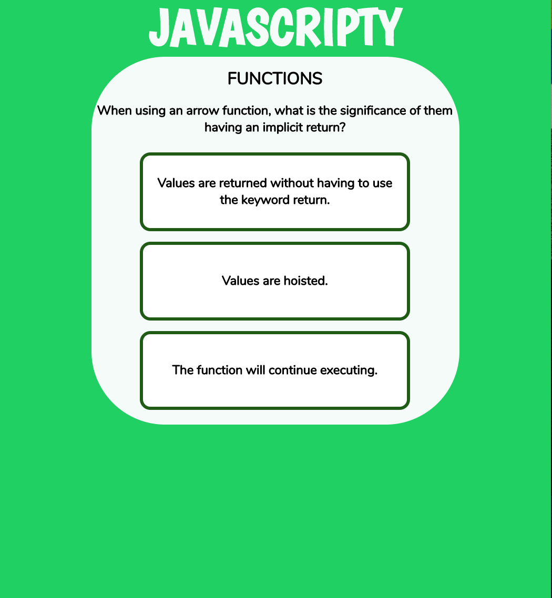

# Javascripty

### Why I Built This: 

I built this application to help those whore are new to the Javascript programming language better understand the foundational concepts of the language. The structure of the application helps users improve their vocublary which will help them improve their ability to speak to different concepts that encapsulate Javascript. 

### How To Study: 

In your terminal enter the following commands: 

`git clone https://github.com/Dhanciles/javascripty`

`cd javascripty`

`npm install`

`npm install node-sass`

`npm start`

### Project Background: 

This project was built during my time at Turing School of Software and Design, and this is my third project using React as my framework. Working on this project allowed me to solidify my knowledge in the core tools that React gives you, which allowed me to build a fast and interactive app that truly mimics the action of one using flash cards to study a subject. 

### Goals for This Project: 
- Utilize localStorage in a React app.
- Stick to Reacts guidelines of writing modular code. 
- Implement a interface that makes the user's experience enjoyable.
- Give new Javascript programmers a resource to help them get over the learning curve, whether in a boot camp, college studying computer science ot learning on their own. 

### Extensions 
- Add more data to my dataset, that would allow my user to filter through different concepts and narrow down the flash cards they would like to study. 
- Recently I discovered how to create a 3d card stack using CSS. During an intermission I plan on adding this to add more depth to the cards, so it really feels like your are moving through a deck of flash cards. 

